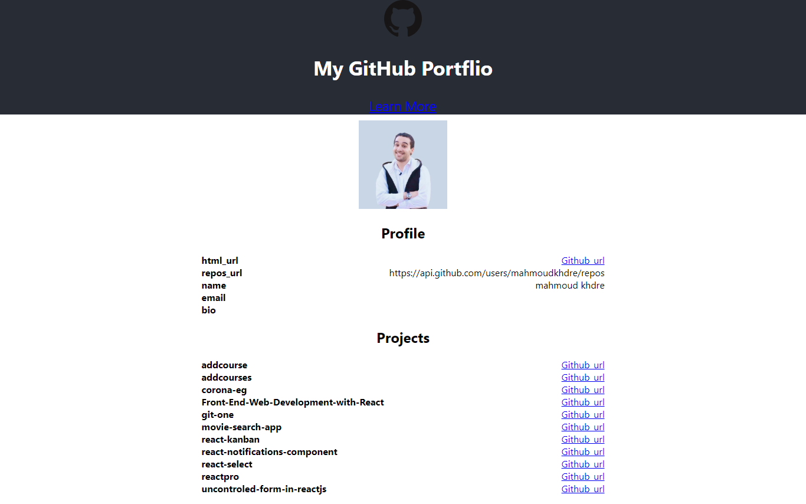

## github repostory

you can show your name ,avatar , bio, email and your repositories you can say it like cv for your projects

to visit the build version of the project. To
build the project, run the following command:
`npm run build`
Then, serve the build version by running the following command:
`serve -s build`
